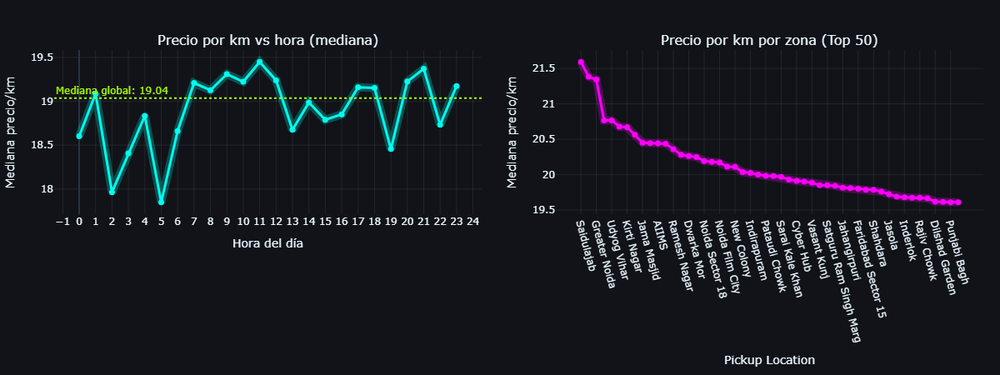

# Uber India Trips — EDA & Dynamic Pricing Patterns 🚕🇮🇳

[](
https://colab.research.google.com/github/moiseslobayza/uber-india-trips-analysis/blob/main/notebooks/uber_india_eda.ipynb
)

---

## Overview

Exploratory Data Analysis (EDA) of Uber trips in India focused on:

- How the **price per kilometer** changes by **hour of day** and **pickup zone**.
- How the **average trip time (Avg CTAT)** behaves across the day.

The goal is to showcase skills in data cleaning, feature engineering, interactive visualization and business–oriented insights.

---

## Dataset

- **Size:** ~150,000 trips  
- **Features:** 22 columns related to bookings and service  
- **Main fields (examples):**
  - `Date`, `Time` – booking date and time  
  - `Booking ID`, `Customer ID`, `Booking Status`  
  - `Vehicle Type`  
  - `Pickup Location`, `Drop Location`  
  - `Ride Distance` – distance travelled  
  - `Booking Value` – total trip value  
  - `Avg VTAT`, `Avg CTAT` – time metrics  
  - `Driver Ratings`, `Customer Rating`, `Payment Method`, etc.

> The full dataset may not be included due to size/license.  
> A small **sample** can be placed in `data/sample/` for quick testing.

---

## Methodology

1. **Data cleaning**
   - Missing values visualization with `missingno`.
   - Imputation:
     - Numeric columns → `0` (when reasonable).
     - Categorical columns → `"Unknown"`.
   - Type casting for dates, times, amounts and distances.
   - Filter out trips with non–positive distance or value.

2. **Feature engineering**
   - `HourFromTime` (0–23) extracted from `Time`.
   - Aggregations by:
     - `HourFromTime`
     - `Pickup Location`
   - `price_per_km` = `Booking Value / Ride Distance`.

3. **EDA & visualizations**
   - Median price per km by hour.
   - Median price per km by pickup zone (with minimum support).
   - Distribution and summary statistics of `Avg CTAT`.
   - Avg CTAT by hour of day.
   - Correlation between time of day and Avg CTAT.

All key plots are implemented with **Plotly** to enable interactive exploration.

---

## Key Findings

- The **global median price per km** is around **19**.
- Clear **peak hours** appear where price per km increases:
  - Morning window (e.g. around 07:00–12:00).
  - Evening–night window (e.g. 20:00–22:00).
- Some **pickup zones** exhibit systematically higher price per km than the global median, suggesting:
  - Higher demand,
  - Heavier traffic,
  - Or “premium” areas with higher willingness to pay.
- This behaviour is consistent with a **dynamic/surge pricing** mechanism based on supply and demand.

---

### Visualization – Median price per km by hour and pickup zone




For **Avg CTAT**:

- Mean trip time is around **30 minutes**, with most values between ~10 and 45 minutes.
- The distribution is roughly symmetric, without heavy tails or extreme outliers.
- The correlation between time of day and Avg CTAT is **close to zero**:
  - Avg CTAT stays relatively stable during the day.
  - Other factors (zone, traffic, distance, external conditions) likely explain more of the variability.

---

## Tech Stack

- **Python**: `pandas`, `numpy`
- **Visualization**: `matplotlib`, `plotly`
- **Data quality**: `missingno`
- **ML / stats**: `scikit-learn` (SimpleImputer), `scipy` (skew, kurtosis)
- **Environment**: Google Colab / Jupyter Notebook

---

## How to Run

```bash
pip install -r requirements.txt
jupyter notebook notebooks/uber_india_eda.ipynb
```
## 📜 License
MIT License — This project is for educational and portfolio purposes.


